My MacOS Quick Actions
===

This repo contains a list of macOS Quick Actions / Services that I use on my machine. They are Automator workflow scripts.

Requirements
---

- Shell: `zsh`
- OS: macOS 11 Big Sur
- [Automator](https://support.apple.com/en-gb/guide/automator/welcome/mac)

Installation
---

Copy scripts from `scripts` folder to `~/Library/Services`.

Scripts
---

### `Brotli file`

Creates a `.br` file of a selected file. Requires [brotli](https://formulae.brew.sh/formula/brotli)

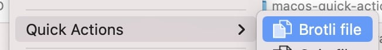 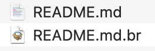

### `Gzip file`

Creates a `gz` file of a selected file. Requires `gzip` (built-in).

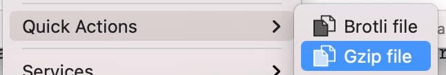 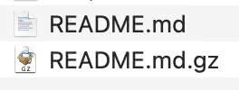

### `Convert to JPEG`

Creates a copy of an image file in JPEG format.

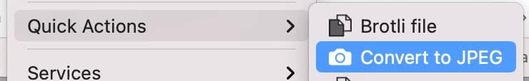 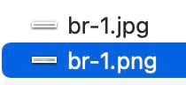

### `Resize images`

Creates copies of selected image files and resize them to a specific size (width).

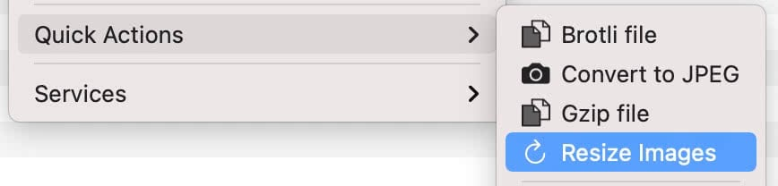 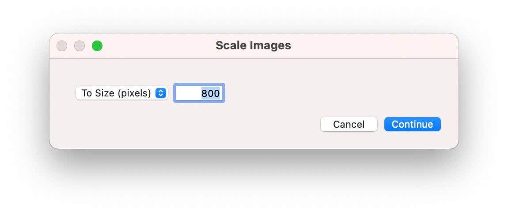 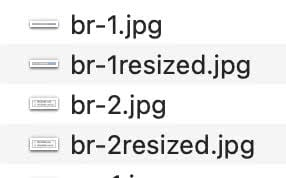

### `Translate to English`

Translates text to English, showing a popup of [Google Translate's website](https://translate.google.com/).

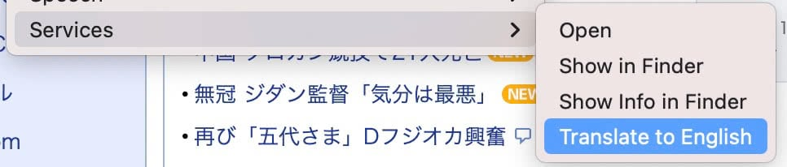 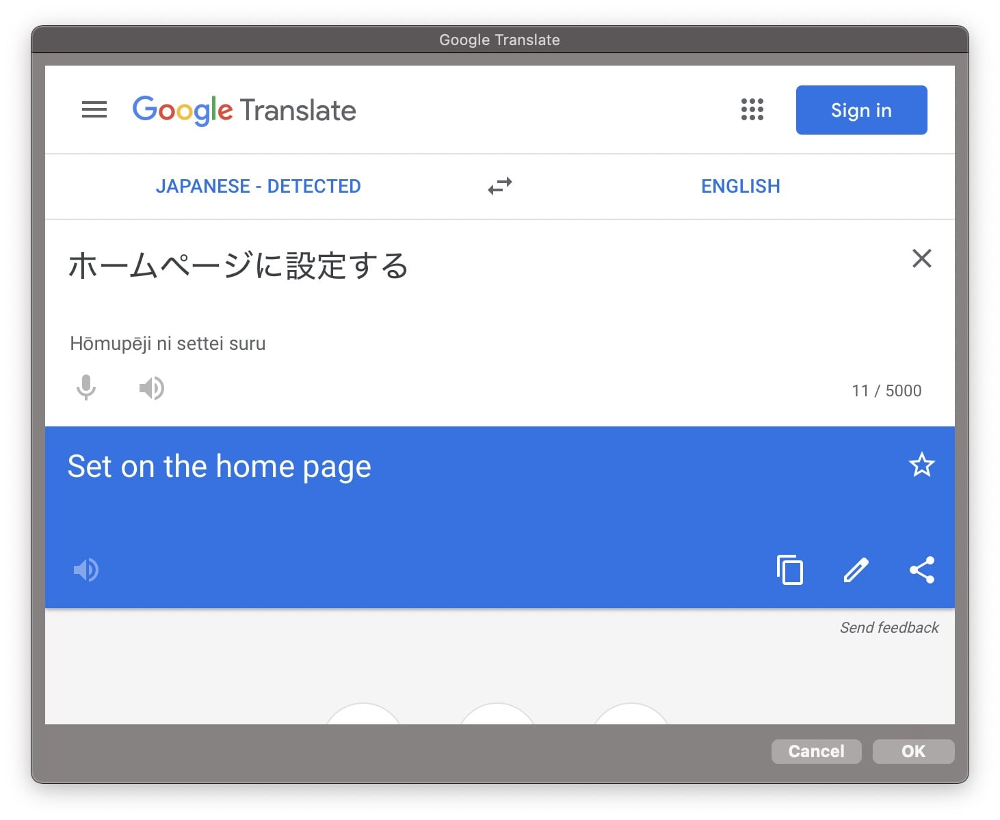

Other useful resources
---

- [Quick Look plugins](https://github.com/sindresorhus/quick-look-plugins)